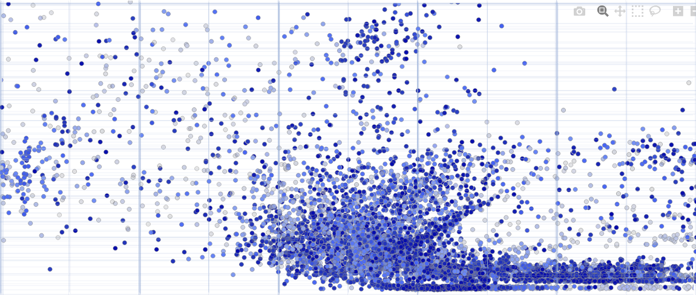
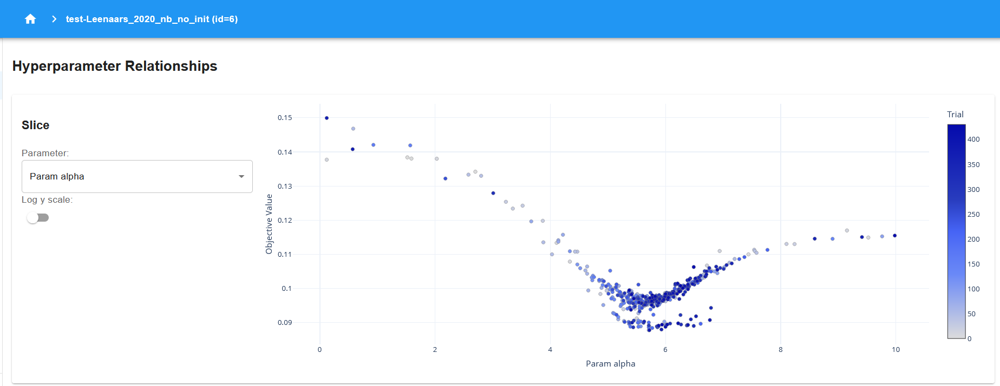

# asreview-optuna

This repository provides tools for testing and optimizing the models found in ASReview via the Optuna package. It includes a Makita template that will generate a folder infrastructure with a jobs file to run the optimizations for a specific model.



## Installation

To get started, clone this repository:

```bash
git clone https://github.com/asreview/asreview-optuna.git
```

Make sure you have all dependencies installed:

```bash
pip install -r requirements.txt
```

## How to Use

### Using the Makita Template

To use the Makita template provided in this repository, download the template and follow the instructions outlined in the [ASReview Makita documentation](https://github.com/asreview/asreview-makita?tab=readme-ov-file#create-and-use-custom-templates) for using a custom template.

#### Steps:

1. Download the template from this repository.
2. Follow the instructions [here](https://github.com/asreview/asreview-makita?tab=readme-ov-file#create-and-use-custom-templates) to integrate and use the template.
3. Generate the folder infrastructure by pointing to the cloned template.
3. Run the optimization jobs using the generated folder infrastructure.

Please note that these instructions are still a work in progress (WIP), and more detailed instructions will be added in the future.

### Running the Optuna Dashboard

After running the template, a file called `db.sqlite3` will be generated inside the output folder. This file contains the optimization results and can be visualized using the Optuna dashboard.



To start the Optuna dashboard, run the following command:

```bash
optuna-dashboard sqlite:///output/db.sqlite3
```

If you are running the dashboard on a server and want it to be publicly accessible, you can use the following command, making sure port 8080 is open:

```bash
optuna-dashboard sqlite:///output/db.sqlite3 --host 0.0.0.0
```

This will allow you to access the dashboard from any device by navigating to `http://<your-server-ip>:8080/`.

## Questions and Contributions

If you have any questions or would like to contribute, please open an issue in the repository's [issues section](https://github.com/asreview/asreview-optuna/issues).

## License

This project is licensed under the MIT License. See the [LICENSE](LICENSE) file for details.

## Authors

The ASReview team.

This extension is part of the ASReview project (asreview.ai). It is maintained by the maintainers of ASReview LAB. See ASReview LAB for contact information and more resources.
